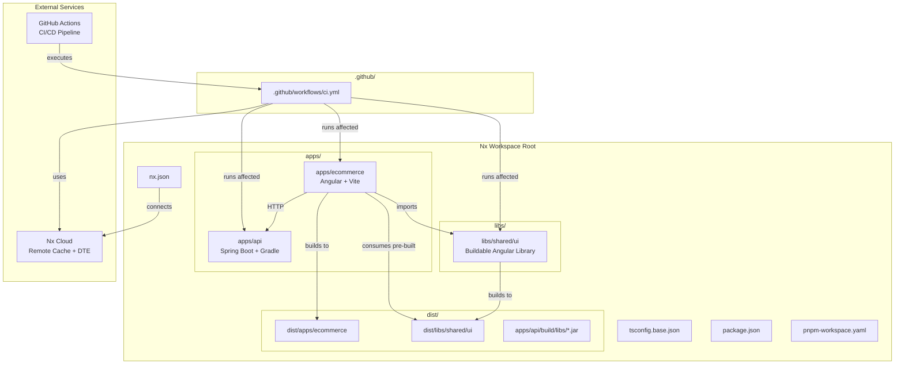
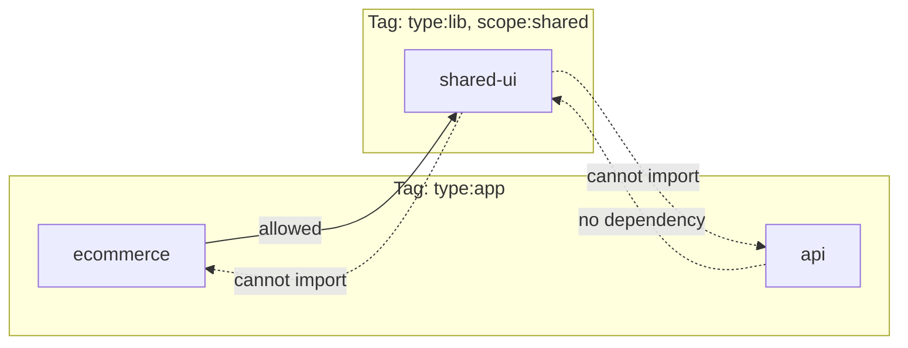
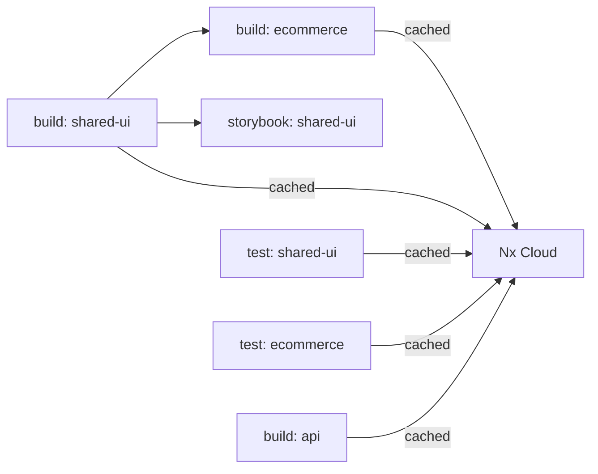
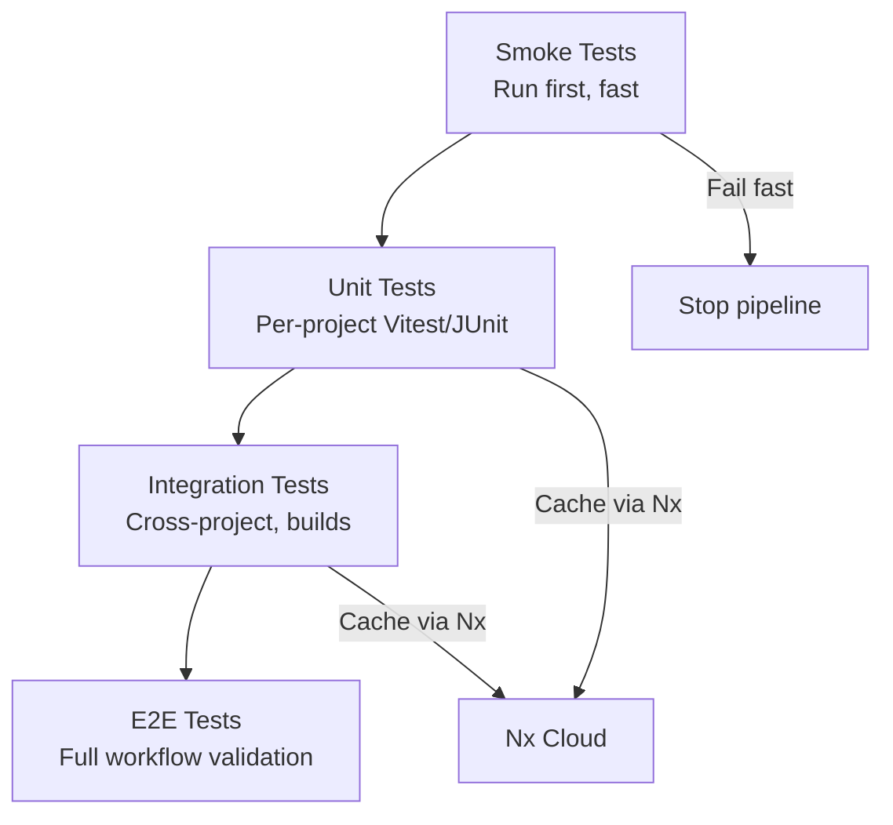

# Design Document: Nx Ecommerce Workspace

## Overview

This design describes the architecture and technical implementation of an Nx monorepo workspace for an ecommerce platform selling 3D printed products. The workspace hosts an Angular frontend (Vite-powered), a Java Spring Boot backend (Gradle-built), and a shared UI component library with Storybook integration. Nx Cloud provides remote caching and distributed task execution on the free tier.

The workspace leverages Nx's plugin-based architecture (Project Crystal) where plugins infer targets from tooling configuration files. **pnpm** is the workspace package manager, providing fast, disk-efficient dependency installation and native workspace support via `pnpm-workspace.yaml`. Key technology choices:

- **Nx 22+** — workspace orchestration, caching, dependency graph
- **pnpm** — fast, disk space efficient package manager with native workspace support
- **Angular 20+** — frontend framework with standalone components
- **Vite 8** via `@analogjs/vite-plugin-angular` — fast dev server and build tool
- **Vitest 4** via `@analogjs/vitest-angular` — unified test runner for all frontend projects
- **Spring Boot 3.x** on Java 17+ — backend REST API
- **Gradle** via `@nx/gradle` plugin — Java build integration with Nx
- **Storybook 10** via `@analogjs/storybook-angular` — component development and documentation
- **Nx Cloud** (free tier) — remote caching and distributed task execution
- **ESLint 9** — flat config format with TypeScript (`eslint.config.ts`)

## Architecture



### Dependency Flow



### Task Pipeline



## Components and Interfaces

### 1. Workspace Root Configuration

| File | Purpose |
|------|---------|
| `nx.json` | Task runner options, `targetDefaults`, `namedInputs`, `nxCloudAccessToken`, `defaultBase`, task pipelines |
| `package.json` | Root devDependencies (nx, @nx/workspace, @nx/angular, @nx/vite, @nx/gradle, @nx/eslint, @nx/eslint-plugin, @nx/storybook, storybook, @storybook/angular), workspace scripts, and `packageManager` field specifying the pnpm version |
| `pnpm-workspace.yaml` | Defines the workspace packages structure for pnpm (includes `apps/*` and `libs/*` directories) |
| `tsconfig.base.json` | Shared `compilerOptions`, `paths` mapping for `@workspace/shared/ui` |
| `eslint.config.ts` | Root ESLint flat config (TypeScript) with `@nx/enforce-module-boundaries` rule and `depConstraints` |

### 2. Angular Frontend Application (`apps/ecommerce`)

| File | Purpose |
|------|---------|
| `project.json` | Nx project configuration with inferred targets from `@nx/angular` and `@nx/vite` plugins |
| `vite.config.ts` | Vite configuration using `@analogjs/vite-plugin-angular` for dev server and production builds |
| `vitest.config.ts` | Vitest configuration using `@analogjs/vitest-angular` for unit testing |
| `tsconfig.app.json` | App-specific TypeScript config extending `tsconfig.base.json` (source paths — used by serve) |
| `tsconfig.build.json` | Build-specific TypeScript config that overrides `paths` to point to `dist/` (artifact paths — used by build) |
| `tsconfig.spec.json` | Test-specific TypeScript config |
| `src/main.ts` | Application bootstrap with `bootstrapApplication()` |
| `src/app/app.component.ts` | Root standalone component |
| `src/app/app.routes.ts` | Route definitions |

**Nx Targets:**
- `build` — Vite production build → `dist/apps/ecommerce` (uses `tsconfig.build.json` with dist paths)
- `serve` — Vite dev server with HMR (uses `tsconfig.app.json` with source paths, no `^build` dependency)
- `test` — Vitest via `@analogjs/vitest-angular`
- `lint` — ESLint with module boundary enforcement

#### TSConfig Path-Switching Pattern

The workspace uses a dual-tsconfig strategy to optimize both local development speed and production build correctness:

**Principle:** `tsconfig.base.json` always points to source (`libs/shared/ui/src/index.ts`). The app's build tsconfig overrides paths to point to pre-built artifacts (`dist/libs/shared/ui`).

**Local dev (`nx serve ecommerce`):**
```
Vite reads tsconfig.app.json (extends tsconfig.base.json)
  └─▶ @workspace/shared/ui → libs/shared/ui/src/index.ts (source)
       └─▶ Full HMR across all libs, instant startup, no pre-build needed
```

**Production build (`nx build ecommerce`):**
```
Vite reads tsconfig.build.json (extends tsconfig.base.json, overrides paths)
  └─▶ @workspace/shared/ui → dist/libs/shared/ui (pre-built artifact)
       └─▶ ^build dependency ensures libs are compiled first
```

**File structure:**

```jsonc
// apps/ecommerce/tsconfig.app.json — used by serve (source paths inherited from base)
{
  "extends": "../../tsconfig.base.json",
  "compilerOptions": {
    "outDir": "../../dist/out-tsc"
  },
  "include": ["src/**/*.ts"],
  "exclude": ["src/**/*.spec.ts"]
}
```

```jsonc
// apps/ecommerce/tsconfig.build.json — used by build (dist paths override)
{
  "extends": "./tsconfig.app.json",
  "compilerOptions": {
    "paths": {
      "@workspace/shared/ui": ["../../dist/libs/shared/ui"]
    }
  }
}
```

**nx.json target defaults:**
```jsonc
{
  "targetDefaults": {
    "build": {
      "dependsOn": ["^build"],  // libs build before app build
      "cache": true
    },
    "serve": {
      "dependsOn": []           // no pre-build needed, Vite resolves source directly
    }
  }
}
```

**Key benefits:**
- `nx serve` starts instantly — no waiting for library builds
- Full HMR across library boundaries during development
- Type errors in libs surface in real time during dev
- Production builds use verified, compiled artifacts with proper tree-shaking
- Nx caching ensures lib builds are near-instant after first run

**Caveats:**
- Each lib must expose a single `index.ts` barrel file entry point for clean path switching
- If a developer runs `nx build ecommerce` locally, lib artifacts must exist in `dist/` — the `^build` dependency handles this automatically
- Storybook can use either source or dist paths depending on configuration (see task 8.2)

### 3. Spring Boot Backend Application (`apps/api`)

| File | Purpose |
|------|---------|
| `project.json` | Nx project configuration delegating to Gradle tasks |
| `build.gradle.kts` | Gradle build script with Spring Boot plugin, Java 17+ toolchain |
| `settings.gradle.kts` | Gradle settings with subproject declarations |
| `src/main/java/.../Application.java` | Spring Boot main class |
| `src/main/resources/application.yml` | Application configuration (port, actuator) |
| `src/test/java/...` | JUnit 5 + Spring Boot Test classes |

**Nx Targets (delegated to Gradle):**
- `build` — `./gradlew :api:bootJar` → executable JAR
- `serve` — `./gradlew :api:bootRun` (port 8080, configurable)
- `test` — `./gradlew :api:test` → JUnit results

### 4. Shared UI Library (`libs/shared/ui`)

| File | Purpose |
|------|---------|
| `project.json` | Nx project config with build, test, storybook, lint targets |
| `ng-package.json` | Angular library package configuration for buildable output |
| `vite.config.ts` | Vite config for library build mode |
| `vitest.config.ts` | Vitest config for component testing |
| `src/index.ts` | Public API entry point exporting all components |
| `src/lib/*.component.ts` | Standalone Angular components |
| `src/lib/*.stories.ts` | Storybook story files |
| `.storybook/main.ts` | Storybook config using `@analogjs/storybook-angular` framework |
| `.storybook/preview.ts` | Storybook preview configuration |

**Nx Targets:**
- `build` — Compiles to `dist/libs/shared/ui` with `package.json`, JS, and type definitions
- `test` — Vitest via `@analogjs/vitest-angular`
- `storybook` — Storybook dev server
- `build-storybook` — Static Storybook build
- `lint` — ESLint

### 5. Nx Cloud Integration

**Configuration in `nx.json`:**
```json
{
  "nxCloudAccessToken": "<token>",
  "tasksRunnerOptions": {
    "default": {
      "runner": "nx-cloud"
    }
  }
}
```

**Behavior:**
- Cache hits served from remote cache (Nx Replay)
- Distributed task execution across CI agents (Nx Agents)
- Graceful fallback to local execution when unreachable
- Invalid token produces error message, proceeds locally

### 6. Module Boundary Enforcement

**ESLint Flat Config (`eslint.config.ts`):**
```typescript
import nx from '@nx/eslint-plugin';

export default [
  ...nx.configs['flat/base'],
  ...nx.configs['flat/typescript'],
  ...nx.configs['flat/javascript'],
  {
    files: ['**/*.ts', '**/*.tsx', '**/*.js', '**/*.jsx'],
    rules: {
      '@nx/enforce-module-boundaries': ['error', {
        enforceBuildableLibDependency: true,
        allow: [],
        depConstraints: [
          { sourceTag: 'type:app', onlyDependOnLibsWithTags: ['type:lib'] },
          { sourceTag: 'type:lib', onlyDependOnLibsWithTags: ['type:lib'] },
          { sourceTag: 'scope:shared', onlyDependOnLibsWithTags: ['scope:shared'] },
        ],
      }],
    },
  },
];
```

**Project Tags:**
- `apps/ecommerce` → `["type:app", "scope:ecommerce"]`
- `apps/api` → `["type:app", "scope:api"]`
- `libs/shared/ui` → `["type:lib", "scope:shared"]`

### 7. Generators

**Component Generator (Shared UI):**
- Creates standalone component file
- Creates co-located `.spec.ts` test file
- Creates co-located `.stories.ts` Storybook story file
- Adds export to `src/index.ts` public API

**Application Generator:**
- Scaffolds new app in `apps/` with build, serve, test, lint targets
- No changes required to existing projects

**Library Generator:**
- Scaffolds new buildable library in `libs/` with build, test, lint targets
- Configures output to `dist/libs/<path>`
- Adds path mapping to `tsconfig.base.json`

### 8. GitHub Actions CI/CD Pipeline

| File | Purpose |
|------|---------|
| `.github/workflows/ci.yml` | Main CI workflow triggered on PRs and pushes to `main` |

**Workflow Triggers:**
- Pull requests targeting `main`
- Pushes to `main`

**Workflow Structure:**

```yaml
name: CI

on:
  push:
    branches: [main]
  pull_request:
    branches: [main]

jobs:
  main:
    runs-on: ubuntu-latest
    steps:
      - uses: actions/checkout@v4
        with:
          fetch-depth: 0

      # Node.js environment for frontend projects
      - uses: actions/setup-node@v4
        with:
          node-version: 20
          cache: 'pnpm'

      # Java environment for backend API
      - uses: actions/setup-java@v4
        with:
          distribution: 'temurin'
          java-version: '17'

      - uses: gradle/actions/setup-gradle@v3

      # pnpm setup
      - uses: pnpm/action-setup@v2
        with:
          version: 9

      - run: pnpm install --frozen-lockfile

      # Determine affected projects using nx-set-shas
      - uses: nrwl/nx-set-shas@v4

      # Run affected tasks with Nx Cloud caching
      - run: pnpm nx affected -t lint test build
```

**Key Configuration Details:**

| Aspect | Configuration |
|--------|--------------|
| `fetch-depth: 0` | Full git history for accurate `nx affected` comparison |
| `nrwl/nx-set-shas@v4` | Sets `NX_BASE` and `NX_HEAD` environment variables for affected detection |
| `pnpm install --frozen-lockfile` | Deterministic dependency installation from lockfile |
| `nx affected -t lint test build` | Runs only lint, test, and build for projects affected by the change |
| Nx Cloud remote caching | Automatically active via `nxCloudAccessToken` in `nx.json` — skips tasks with matching cache entries |

**Nx Cloud GitHub App Integration:**
- Provides PR comments with build status, cache statistics, and task timings
- Links to Nx Cloud dashboard for detailed run analysis
- Configured at the GitHub organization/repository level (no workflow file changes needed)

**Branch Protection Rules (configured in GitHub repository settings):**

| Rule | Value |
|------|-------|
| Require status checks to pass | Enabled |
| Required status check | `CI` workflow job (`main`) |
| Require branches to be up to date | Enabled |
| Require pull request reviews | Optional (team preference) |

**Dual Environment Support:**
- **Node.js 20** — Builds and tests `ecommerce` app and `shared-ui` library (Vite, Vitest, ESLint)
- **Java 17 (Temurin)** — Builds and tests `api` app (Gradle, Spring Boot, JUnit 5)
- Both environments coexist in a single job since Nx orchestrates task execution order

## Data Models

### Nx Project Graph Node

```typescript
interface ProjectGraphNode {
  name: string;           // e.g., "ecommerce", "api", "shared-ui"
  type: "app" | "lib";
  data: {
    root: string;         // e.g., "apps/ecommerce"
    sourceRoot: string;   // e.g., "apps/ecommerce/src"
    targets: Record<string, TargetConfiguration>;
    tags: string[];       // e.g., ["type:app", "scope:ecommerce"]
  };
}
```

### Target Configuration

```typescript
interface TargetConfiguration {
  executor?: string;      // e.g., "@nx/vite:build"
  options?: Record<string, unknown>;
  configurations?: {
    production?: Record<string, unknown>;
    development?: Record<string, unknown>;
  };
  dependsOn?: Array<string | { target: string; projects: string }>;
  inputs?: string[];
  outputs?: string[];
  cache?: boolean;
}
```

### Task Pipeline Configuration (nx.json)

```typescript
interface NxJsonTaskPipeline {
  targetDefaults: {
    build: {
      dependsOn: ["^build"];  // Build dependencies first
      inputs: ["production", "^production"];
      outputs: ["{options.outputPath}"];
      cache: true;
    };
    serve: {
      dependsOn: [];          // No pre-build needed — Vite resolves source paths directly
    };
    test: {
      inputs: ["default", "^production"];
      cache: true;
    };
    lint: {
      inputs: ["default", "{workspaceRoot}/eslint.config.ts"];
      cache: true;
    };
  };
  namedInputs: {
    default: ["{projectRoot}/**/*", "sharedGlobals"];
    production: ["default", "!{projectRoot}/**/*.spec.ts", "!{projectRoot}/**/*.stories.ts"];
    sharedGlobals: ["{workspaceRoot}/tsconfig.base.json"];
  };
}
```

### Buildable Library Output

```typescript
interface BuildableLibraryOutput {
  directory: string;      // "dist/libs/shared/ui"
  packageJson: {
    name: string;         // "@workspace/shared/ui"
    version: string;
    main: string;         // "./index.js"
    typings: string;      // "./index.d.ts"
    module: string;       // "./esm/index.js"
  };
  compiledFiles: string[];  // JS + .d.ts files
}
```

### Gradle Subproject Structure (Backend API)

```kotlin
// settings.gradle.kts
rootProject.name = "api"
include("core")        // Domain models, business logic
include("web")         // REST controllers, DTOs
include("persistence") // Repository implementations
```

### Cache Entry

```typescript
interface CacheEntry {
  hash: string;           // SHA of inputs (source, config, dep outputs)
  outputs: string[];      // Cached output paths
  source: "local" | "remote";
  timestamp: number;
}
```

## Error Handling

### Nx Cloud Connectivity Failures

| Scenario | Behavior |
|----------|----------|
| Nx Cloud unreachable during task execution | Fall back to local execution, display warning, continue build |
| Invalid access token | Display authentication error, proceed with local execution |
| Remote cache miss | Execute task locally, upload result to remote cache on completion |
| Network timeout during cache upload | Task succeeds locally, cache upload silently fails |

**Implementation:** Nx Cloud's runner handles these scenarios natively. The `nx.json` configuration enables graceful degradation by default. No custom error handling code is required — Nx's built-in runner provides fallback behavior.

### Build Failures

| Scenario | Behavior |
|----------|----------|
| Library build fails | Cancel all dependent downstream tasks, allow independent tasks to complete |
| Application build fails | Report error with exit code, no downstream tasks exist |
| Gradle compilation error | Report Java compiler errors through Nx output, exit non-zero |
| Vite build error | Report bundling error with file location, exit non-zero |

**Implementation:** Nx's task orchestration engine handles failure propagation. The `dependsOn` configuration in `targetDefaults` ensures correct cancellation of dependent tasks. Each executor (Vite, Gradle) reports errors in its native format, which Nx passes through to the terminal.

### Port Conflicts (Backend API)

| Scenario | Behavior |
|----------|----------|
| Port 8080 in use | Spring Boot fails to bind, logs `PortInUseException`, exits with non-zero code |
| Custom port in use | Same behavior with configured port number in error message |

**Implementation:** Spring Boot's embedded Tomcat throws `PortInUseException` which is caught by the `FailureAnalyzer` and produces a human-readable error message. No custom handling needed.

### Generator Failures

| Scenario | Behavior |
|----------|----------|
| Invalid project name | Generator rejects with validation error before creating files |
| Target directory already exists | Generator reports conflict, does not overwrite |
| Missing dependencies | Generator reports missing plugin packages |

**Implementation:** Nx generators validate inputs before execution and use a virtual file system that only commits changes on success (atomic operation).

### Storybook Failures

| Scenario | Behavior |
|----------|----------|
| Storybook fails to start | Display error cause, exit with non-zero status code |
| Story file has syntax error | Storybook reports compilation error with file location |
| Missing component dependency | Storybook reports import resolution error |

**Implementation:** Storybook's Vite-based builder reports errors through Vite's error overlay in dev mode and through terminal output with file locations.

### Test Failures

| Scenario | Behavior |
|----------|----------|
| Vitest test fails | Report file path, test name, expected vs received values, exit non-zero |
| JUnit test fails | Report test class, method, assertion message through Gradle output |
| Test timeout | Vitest/JUnit report timeout with test identifier |

**Implementation:** Vitest and JUnit both provide structured failure output. Nx passes through the test runner's output format unchanged.

### CI Pipeline Failures

| Scenario | Behavior |
|----------|----------|
| `nx affected` build task fails | Workflow exits with non-zero status, failing task name reported in GitHub Actions summary |
| `nx affected` test task fails | Workflow exits with non-zero status, test failure details visible in job logs |
| `nx affected` lint task fails | Workflow exits with non-zero status, lint violations reported in job logs |
| `nx-set-shas` cannot determine base SHA | Falls back to `defaultBase` configured in `nx.json` (typically `main`) |
| Nx Cloud unreachable during CI | Tasks execute locally within the runner, CI completes without cache optimization |
| `pnpm install --frozen-lockfile` fails | Workflow fails immediately with dependency resolution error |
| Java/Gradle setup fails | Workflow fails at setup step, no tasks execute |
| Node.js setup fails | Workflow fails at setup step, no tasks execute |
| Branch protection check fails | PR cannot be merged until CI workflow passes |

**Implementation:** GitHub Actions natively propagates non-zero exit codes from `nx affected` as workflow failures. The `nx-set-shas` action handles edge cases (new repos, force pushes) by falling back to comparing against the default branch. Nx Cloud connectivity failures are handled by Nx's built-in graceful degradation — the CI pipeline continues with local execution rather than failing.

## Testing Strategy

### Why Property-Based Testing Does Not Apply

This feature is primarily **infrastructure configuration and workspace scaffolding**. The acceptance criteria test:
- File/directory existence (smoke tests)
- External tool behavior — Nx, Vite, Gradle, Storybook, Nx Cloud (integration tests)
- Specific error scenarios (example-based tests)

None of the criteria involve pure functions with meaningful input variation where 100+ iterations would find more bugs than 2-3 examples. The correct testing approach is a combination of smoke tests, integration tests, and example-based tests.

### Test Categories

#### 1. Smoke Tests (Configuration Validation)

Verify workspace structure and configuration files are correct after initialization.

**Scope:** Requirements 1.1–1.9, 2.1, 3.1–3.3, 3.6, 4.1–4.3, 5.1–5.3, 5.6, 6.1, 6.3, 7.1–7.2, 9.5, 10.8, 11.1–11.2

**Approach:**
- Schema validation of `nx.json`, `package.json`, `tsconfig.base.json`, `pnpm-workspace.yaml`
- Directory existence checks for `apps/ecommerce`, `apps/api`, `libs/shared/ui`
- Configuration file content assertions (correct plugins, paths, targets, `packageManager` field)
- Validate `.github/workflows/ci.yml` exists with correct trigger configuration and required steps
- Run once after workspace generation

**Tools:** Node.js test scripts with `fs` assertions, JSON schema validation

#### 2. Integration Tests (Tool Behavior)

Verify that Nx commands, builds, and external tools work correctly end-to-end.

**Scope:** Requirements 2.2–2.3, 3.4–3.5, 3.7, 4.4–4.6, 4.8, 5.4–5.5, 6.2, 6.4–6.5, 6.7, 7.3–7.4, 7.6, 8.1–8.5, 9.1–9.4, 9.6–9.7, 10.1–10.7, 10.9, 11.3–11.7

**Approach:**
- Execute Nx commands and verify outputs
- Build projects and verify artifacts
- Start servers and verify responses
- Run generators and verify file creation
- Test caching behavior (run twice, verify cache hit)
- Test affected command with git changes
- Verify CI workflow executes `nx affected` with correct base/head SHAs
- Verify Nx Cloud caching is active during CI runs
- Verify dual environment (Node.js + Java) setup in workflow

**Tools:** Shell scripts, CI pipeline tests, Nx e2e testing utilities

#### 3. Example-Based Tests (Error Scenarios)

Verify specific error conditions produce correct behavior.

**Scope:** Requirements 2.4–2.5, 4.7, 6.6, 7.5, 7.7, 8.3, 9.8, 11.8–11.9

**Approach:**
- Simulate failure conditions (network outage, port conflict, invalid config)
- Verify error messages contain expected information
- Verify exit codes are non-zero
- Verify graceful degradation (fallback to local execution)

**Tools:** Shell scripts with mocked conditions, test fixtures with intentional errors

### Test Execution Strategy



### Per-Project Test Configuration

| Project | Test Runner | Config File | Command |
|---------|-------------|-------------|---------|
| `ecommerce` | Vitest + @analogjs/vitest-angular | `vitest.config.ts` | `nx test ecommerce` |
| `shared-ui` | Vitest + @analogjs/vitest-angular | `vitest.config.ts` | `nx test shared-ui` |
| `api` | JUnit 5 + Spring Boot Test | `build.gradle.kts` | `nx test api` |

### CI Pipeline Testing

1. **Smoke tests** — Validate workspace structure and CI workflow file (< 10s)
2. **Affected tests** — Run `nx affected -t test` for changed projects
3. **Build verification** — Run `nx affected -t build` with Nx Cloud caching
4. **Lint verification** — Run `nx affected -t lint` for changed projects
5. **Integration tests** — Verify cross-project imports, incremental builds
6. **Storybook build** — Run `nx build-storybook shared-ui` to verify component documentation builds
7. **CI workflow validation** — Verify `nx-set-shas` correctly sets base/head, affected detection works, and Nx Cloud caching is leveraged

### Caching Strategy for Tests

- All test targets are cacheable (`cache: true` in `targetDefaults`)
- Test inputs include source files, config files, and dependency outputs
- Nx Cloud stores test results remotely for CI reuse
- Local cache serves as fallback when Nx Cloud is unreachable

